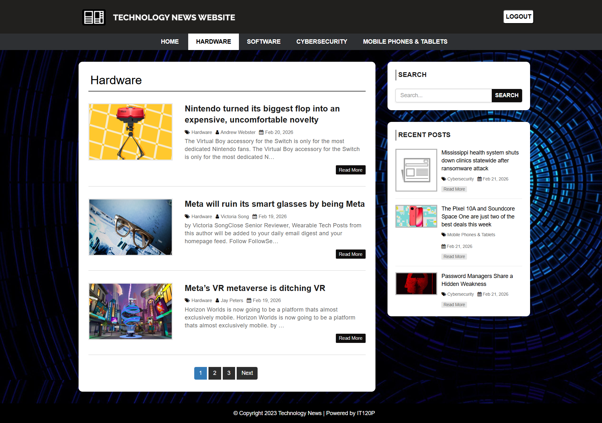
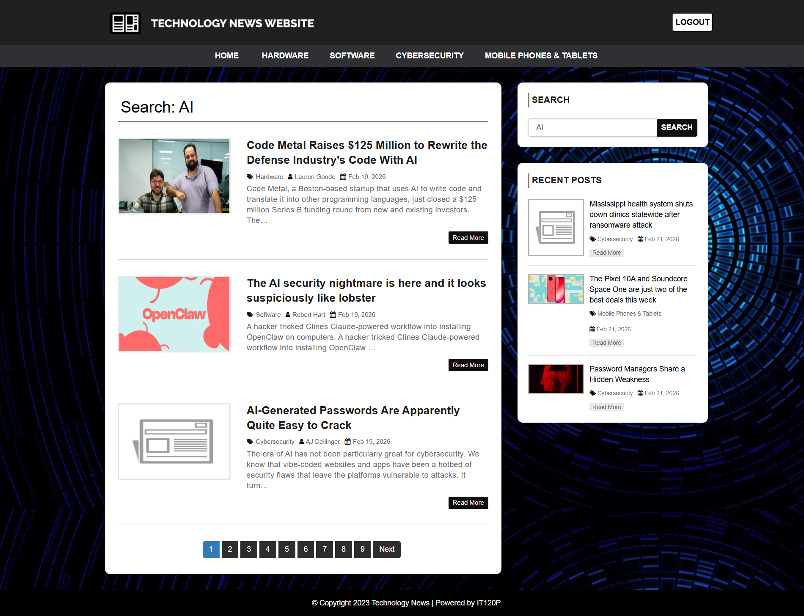
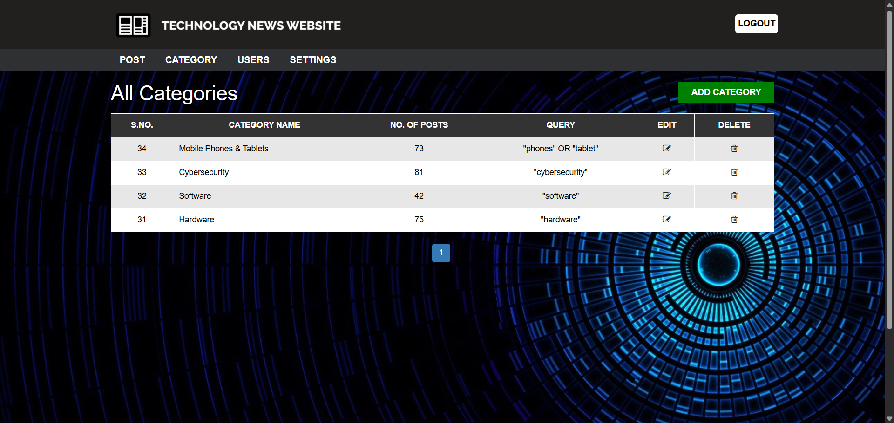
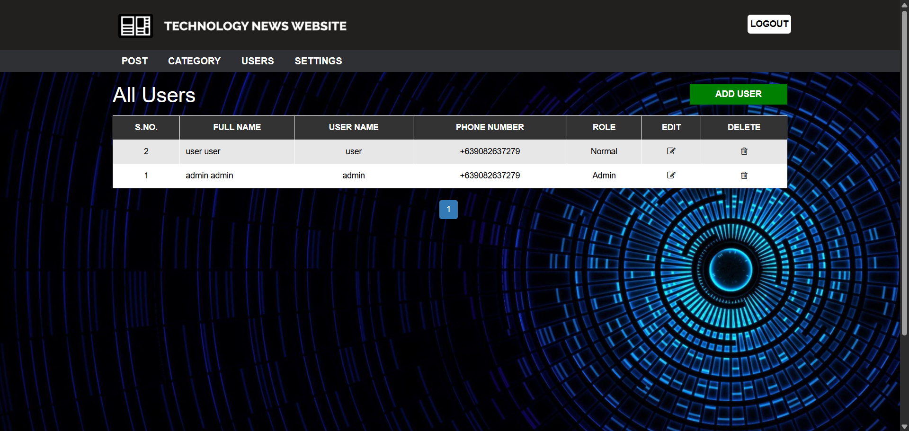

<div align="center">
  <h1 align="center">TechNews - CMS Platform</h1>
  <div align="center">
    <a href="https://technews-j6sa.onrender.com">
      
    </a>
  </div>
</div>

---

# 📱 What is TechNews?

A full-stack content management system (CMS) for publishing and managing technology news articles.

---

# 👤 User Features

## Homepage


_Displays the latest technology news with featured images and categories_

## Article Page


_Article view with formatted content, author information, and publish date_

## Search & Filtering


_Search functionality to find articles by keywords, authors, or categories_

---

# 🔧 Admin Control Panel

## Content Management


_Admin panel for managing all posts, categories, and users in one place_

## Create New Posts


_Editor for creating new articles with its corresponding information_

## Category Management


_Organize content with custom categories and corresponding query for News API_

## User Management


_Admin tools to manage user accounts, roles, and permissions_

---

# 🔐 Authentication System

## Main Login


_Authentication system with session management_

## User Registration


_Registration process_

---

# 🛠️ Technical Highlights

## Architecture

```
Frontend: HTML5, CSS3, Bootstrap
Backend: PHP 7.4+
Database: MySQL
Hosting: Render & Aiven (Production)
```

## Key Technical Features

- **RESTful Architecture** - Clean separation of client and server
- **Session Management** - Secure user authentication
- **API Integration** - NewsAPI for automated content updates
- **SMS Notifications** - ClickSend integration for user alerts

## Security Implementations

- Session Security (proper session handling)
- Password Hashing (bcrypt)
- Role-Based Access Control (Admin/User separation)
- Input Validation & Sanitization

### Technical Achievement

- Built complete CRUD operations for 3 data models (Posts, Categories, Users)
- Integrated 2 third-party APIs (NewsAPI, ClickSend)
- Deployed production-ready application with SSL
